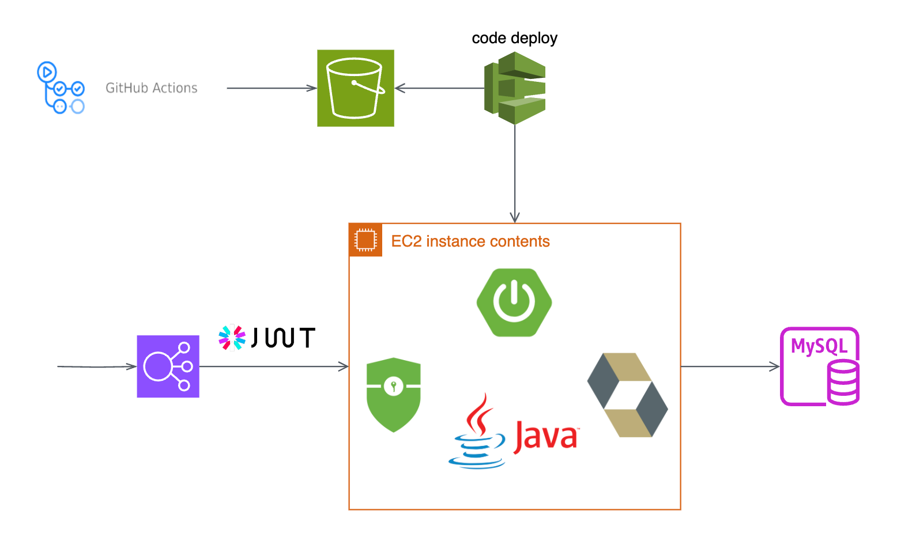

# gummy-dang
멋쟁이사자처럼 12기 해커톤 "개발 빠진 쥐" 팀 백엔드 레포지토리

## 역할
| 이건                                                                                                                                                                                                                                     | 이선우                       | 강채은 |
|----------------------------------------------------------------------------------------------------------------------------------------------------------------------------------------------------------------------------------------|---------------------------|-----|
| - 아키텍처 설계  - AWS 기반 인프라 구축 (HTTPS 적용)  - CI/CD 환경 구축  - 인증/인가 기능 구현 (JWT 기반 일반 로그인 및 카카오 로그인)  - 리워드 기능 및 API 구현  - 산책기록 생성, 조회, 수정, 삭제 API 구현  - 이미지 프로세싱 API 구현  - 회원 정보 생성, 수정, 조회, 삭제 API 리팩토링  - 산책 게시글 생성, 조회, 수정, 삭제 API 리팩토링 | - 회원 정보 수정, 조회, 삭제 API 구현 | - 산책 게시글 생성, 조회, 수정, 삭제 API 구현  |

## 개발 환경
- AWS EC2 (Ubuntu 24.04 LTS)
- AWS LB, ACM, Route53 (HTTPS)
- Spring
- JAVA 17
- MySQL 8.x
- JPA
- Github Actions (CI/CD)

## 아키텍처

## 설명
- JWT 기반 인증/인가 도입, HTTPS 적용을 통해 보안 강화
- OAuth2.0(카카오)를 도입하여 인증/인가 과정 최소화
- 유저 권한 검사를 통한 보안 유지
- CI/CD를 통한 배포 간편화
